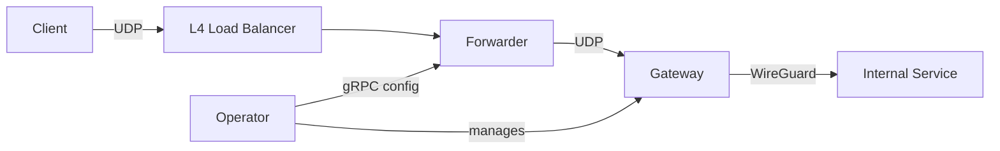

# tunnel-operator

Kubernetes operator for point-to-point WireGuard tunnels between developer workstations and internal services.

**Operator** reconciles `Tunnel` CRs, spins up gateway pods, allocates forwarder ports, and serves port mappings over gRPC.

**Forwarder** is an HPA-scaled UDP reverse proxy that routes client traffic to the correct gateway based on port.

**Gateway** runs one instance per tunnel with userspace WireGuard (wireguard-go + gVisor netstack), proxying decrypted traffic to the target.

